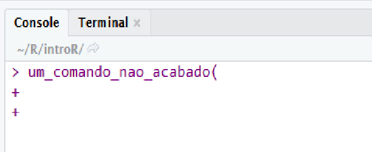

background-image: url(www/slide1.png)
background-size: cover

<link rel="stylesheet" type="text/css" href="www/enap.css">


---

```{r setup, include=FALSE}
options(htmltools.dir.version = FALSE, max.print = 30, digits = 4)
# knitr::opts_chunk$set(fig.align = "center", fig.width = 10, fig.height = 6)
library(tidyverse)

theme_set(
  theme_grey() + theme(legend.position = "top")
)
knitr::opts_chunk$set(
  warning = FALSE, message = FALSE, 
  fig.align = "center", fig.retina = 2, cache = TRUE
)
knitr::opts_hooks$set(fig.callout = function(options) {
  if (options$fig.callout) {
    options$echo <- FALSE
    options$out.width <- "100%"
    options$out.height <- "97%"
  }
  options
})
knitr::opts_hooks$set(fig.principal = function(options) {
  if (options$fig.principal) {
    options$echo <- FALSE
    options$fig.width <- 10
    options$fig.height <- 6
    options$out.width <- "75%"
  }
  options
})
```

# Apresentações

<br>


* Tomás de Siervi Barcellos

* <a>Coordenador de Inovação</a> do Ministério da Agricultura, Pecuária e Abastecimento
  
* Dedicado ao estudo do <a>R</a> há `r lubridate::year(Sys.Date()) - 2016` anos

---

# Percurso do curso

<br/>
<br/>

1. Noções de **R**

2. Ciclo da ciência de dados e tidyverse

3. Dados relacionais

4. Lidando com textos

5. Funções e programação funcional

6. Comunicação: Gráficos

7. Comunicação: Markdown e shiny

---

# Percurso de hoje

1. Objetos

2. Vetores

3. Comparações lógicas e numéricas

4. Tidyverse

5. Importação de dados

6. Manipulação de dados

7. Visualização de dados

---

class: center, middle

# Para que aprender <a>R</a>?

---

# Como vamos aprender <a>R</a>?

1. Explicação de conceitos / funções / ideias

2. Escrever e executar os comandos

3. Repetir algumas vezes `1` e `2`

4. Exercícios

---
background-image: url(https://raw.githubusercontent.com/hadley/r4ds/master/diagrams/rstudio-editor.png)
background-size: 70%

---

# <a>RStudio</a>

<br/>
<br/>

1. Editor -> Roteiro

2. Console -> Filmagem

3. Output -> Televisão

---

# Atalhos úteis

<br><br>

|Teclas | O que faz |
|-------|-----------|
| Ctrl + Enter | Executa a linha atual do script |
| Alt + - | Inclui o operador de atribuição (<-) |
| Ctrl + Shift + M | Inclui o `pipe` (%>%) |
| Ctrl + 1 | Muda foco para o script |
| Ctrl + 2 | Muda foco para o console |
| Alt + Shit + K | Mostra todos os atalhos |

---

# Como pedir ajuda?

<br><br>

* google: copiar e colar mensagens erros

* [stackoverflow](pt.stackoverflow.com) em português: descrever o problema

* R: função <a>help(problema)</a> ou <a>?problema</a>

---
class: center, middle

# <a>Introdução ao **R**</a>

---

# Introdução ao <a>R</a>

> Tudo que existe é um objeto. Tudo o que acontece é o chamado de uma função.

.pull-right[
  John Chambers, criador do **S**
]

<br>

ou 

> Tudo o que é existe é um subjetivo. Tudo o que acontece é um verbo.

---

# objetos

Objetos são nomes que guardam informações.

Nomes devem começar com letra. Após essa letra podem ter números, letras, 
"." ou "_". 

```{r, eval=FALSE}
nome
nome_valido # usaremos esse tipo como convenção
2nome_invalido
nome.valido
nome_valido2
```

---

# objetos

```{r, error = TRUE}
horas <- 20
horas

ofertante <- "Enap"
Ofertante
ofertante
```

---

# objetos: tipos

```{r}
class(horas) # numéricos
class(ofertante) # caracteres (strings)
```

---

# objetos: tipos

```{r}
head(iris)
class(iris) # data.frame (bases de dados)
```

---

# objetos

```{r}
20 + 20

horas + horas

sum(horas, horas, 25)
```

---

# vetores

Conjunto de valores de mesmo tipo.

```{r}
c(1, 6, 11, 16, 21)
1:5
```

---

# vetores

Com `subsetting` podemos escolher partes do vetor

```{r}
vetor <- c(1, 6, 11, 16)

vetor[1]
vetor[-1]
```

---

# vetores

Com `subsetting` podemos escolher partes do vetor

```{r}
vetor[c(TRUE, FALSE, FALSE, TRUE)]

vetor[!c(TRUE, FALSE, FALSE, TRUE)]
```

---

# erros: sintaxe

.center[
  ### <a>**ATENÇÃO**</a>: certifique-se que os comandos estão escritos corretamente
]


```{r, error = TRUE}
lingua <- "português"
Iingua
Lingua
lingua
```

---

# erros: sintaxe

.center[
  ### <a>**ATENÇÃO**</a>: Lembre-se de terminar os comandos
]



O <a>+</a> no console indica que o <a>R</a> ainda está esperando instruções.
Isso pode significar que você enviou apenas parte do comando. 

Aperte <a>ESQ</a> e insira o comando novamente. Certifique-se que o comando 
foi devidamente encerrado

---

# erros: semântica

<br>

.center[
  ### <a>**ATENÇÃO**</a>: Os comandos devem fazer sentido
]

<br>

```{r, error = TRUE}
ofertante + horas
```

**Leia as mensagens**: elas ajudam a identificar erros.

---

# comparação

```{r}
# maior
2 + 2 > 4

# maior ou igual
2 + 2 >= 4

# menor
horas < 5

# menor ou igual
horas <= 5
```

---

# comparação

```{r}
# igual
horas == 2

# diferente
horas != 2

# presente em
c(2, 10) %in% 1:5
```

---

# operadores lógicos

```{r}
# ou 
TRUE | FALSE

# e
TRUE & FALSE

# negação / não
!FALSE
```

---

# operadores lógicos

```{r}
# todos
all(1:5 > 2)

# algum (pelo menos um)
any(1:5 <= 2)
```

---

# valores especiais

```{r}
NA # Not Available / "Não sei"
NaN  # Not a Number: 1/0
Inf  # Infinito
NULL # Vazio
```

---

# valores especiais: NA

```{r}
nas <- c(1, NA, 3)
nas == 1
nas == NA
is.na(nas)
```

---

# Operações vetoriais

```{r}
x <- 1:10
y <- 1:2

x + 3 # reciclagem
y * 7
x + 1:3
```

---

# Coerção

O <a>R</a> tenta resolver a heterogeneidade de vetores igualando-os pelo tipo 
mais complexo.

A complexidade segue esta ordem: caracter > numérico > inteiro > lógico

```{r}
c(FALSE, TRUE, 1L) # inteiro > lógico

c(1L, 2.4, 3.5) # numérico > inteiro

c(1, 2, 3, "texto") # caracter > numérico
```

---
class: center

# Exercícios

---

# Pacotes

Os pacotes são a forma na qual o <a>R</a> é extendido. Para instalar um pacote 
usamos a função <a>install.packages()</a> informando entre aspas o nome do 
pacote que desejamos instalar.

Instalar um pacote é como comprar um livro. Ele vai para sua estante.

```{r, eval = FALSE}
# O "tidyverse" inclui alguns pacotes muito usados no R
# como "ggplot2", "dplyr", "tidyr" e "readr"
install.packages("tidyverse")
```

---
background-image: url(www/tidyverse.png)
background-size: cover
class: center

---

# Pacotes

Para usar as funcionalidades de um pacote devemos pedir ao <a>R</a> que carregue 
o pacote com a função <a>library()</a>. Isso geralmente é feito no início do 
script.

```{r, eval = FALSE}
library(tidyverse)
```

Carregar um pacote é como tirar o livro da estante e acessar seu conhecimento.

---
background-image: url(www/kongfu.jpg)
background-size: 100%
class: center

---
background-image: url(www/data-science.png)
background-size: 100%

# Ciclo da ciência de dados

---

# Importar os dados

```{r}
imdb <- read_rds("dados/imdb.rds")
```

---
background-image: url(www/getwd.jpg)
background-size: cover

---

# O que importamos?

```{r}
imdb
```

---

# O que importamos?

```{r}
glimpse(imdb)
```

---


# %>% (pipe)

O <a>pipe</a> está baseado na pintura do artista belga Magritte.

```{r}
valores <- rnorm(10, 10, 2)
mean(abs(diff(valores)))
```

<br>

Vejamos a mesma operação com o <a>pipe</a>

```{r}
# Ceci n'est pas une "operador"
# library(magrittr)
valores %>% 
  diff() %>% 
  abs() %>% 
  mean()
```

---

# dplyr: principais <a>verbos</a>

<br/>
<br/>

1. Pegar as observações por seus valores (<a>filter()</a>).

2. Reordenar as linhas (<a>arrange()</a>).

3. Pegar variáveis por seus nomes (<a>select()</a>).

4. Criar novas criáveis com base em variáveis existentes (<a>mutate()</a>).

5. Reduzir muitos valores à um sumário (<a>summarise()</a>).

---

# filter

```{r}
imdb %>% 
  filter(diretor ==  "Walter Salles")
```

---

# arrange

Use <a>arrange()</a> para reordenar as observações (linhas)

```{r}
imdb %>% 
  arrange(nota_imdb)
```

---

# select

Formas mais comuns de usar o <a>select</a>

```{r}
imdb %>% 
  select(titulo, ano, diretor, duracao)
```

---

# mutate

Use <a>mutate()</a> para criar novas variáveis baseadas nas variáveis existentes

```{r}
imdb %>% 
  mutate(orcamento = orcamento / 1000000) # em milhoes
```

---
# group_by
Use <a>group_by()</a> para agrupar os dados e realizar operações para cada grupo
```{r}
imdb %>% 
  group_by(diretor) %>% 
  filter(nota_imdb == max(nota_imdb, na.rm = TRUE))
```


---
# summarise
Use <a>summarise()</a> para criar resumos dos dados. As funções passadas devem 
retornar um único valor
```{r}
imdb %>% 
  summarise(media = mean(nota_imdb, na.rm = TRUE))
```


---
# summarise
Use <a>summarise()</a> para criar resumos dos dados. As funções passadas devem 
retornar um único valor
```{r}
imdb %>% 
  group_by(diretor) %>% 
  summarise(media = mean(nota_imdb, na.rm = TRUE)) %>% 
  arrange(desc(media))
```

---
class: center

# Exercícios

---

# A gramática dos gráficos

```{r, fig.principal = TRUE}
dados <- tibble(id = rep(1:7, each = 4),
                x = rep(c(1, 2, 3, 2), 7),) %>%
  mutate(
    y = c(1, 0, 1, 2) + id,
    id = factor(id)
  )
  
etiquetas <- tibble(
  x = 2.3, y = 1:7 + 0.6, label = c(
    "Dados", "Estéticas", "Geometrias", "Facetas", 
    "Estatísticas", "Coordenadas", "Temas"
  )
)
camadas <- ggplot(dados, aes(x, y)) +
  geom_polygon(aes(group = id, fill = id), alpha = 0.95) +
  geom_text(aes(x, y, label = label), data = etiquetas,
            size = 6, angle = 15, col = "gray30", fontface = "bold") +
  theme_void() +
  theme(legend.position = "none")
camadas
```

---

# Dados

> Atrás de todo gráfico legal existe um data frame organizado.
Para focar em nosso objetivo, vamos trabalhar com um conjunto de dados organizado.

Lembre-se que tabelas do tipo _long_ são mais amigáveis ao ggplot2.

```{r carga}
filmes_recentes <- imdb %>% 
  filter(ano >= 2015) %>% 
  mutate(orcamento = orcamento / 1000000,
         receita = receita / 1000000, # em milhões
         lucro = receita - orcamento) 
```
---

# Representando dados

.pull-left[
```{r repes-dados, eval=FALSE}
ggplot(filmes_recentes, 
       aes(x = duracao, y = orcamento)) +
  geom_point()
```
]

.pull-right[
```{r, ref.label="repes-dados", echo=FALSE, fig.callout = TRUE}
```
]

---

# geom_col() ou geom_bar()

.pull-left[
```{r plot-bar, eval=FALSE}
quantidades <- imdb %>% 
  group_by(classificacao) %>%
  summarise(
    media = mean(orcamento, na.rm = TRUE)
  )
ggplot(quantidades, 
       aes(classificacao, media)) +
  geom_col() 
  # ou geom_bar(stat = "identity") 
```
]

.pull-right[
```{r, ref.label="plot-bar", fig.callout = TRUE}
```
]

---

# geom_line() 

.pull-left[
```{r plot-linha, eval=FALSE}
media_scorsese <- imdb %>% 
  filter(diretor == "Martin Scorsese") %>% 
  group_by(ano) %>% 
  summarise(
    nota = mean(nota_imdb, na.rm = TRUE)
  )
ggplot(media_scorsese, 
       aes(ano, nota)) +
  geom_line()
```
]

.pull-right[
```{r, ref.label="plot-linha", fig.callout = TRUE}
```
]

---

# Aspectos Estéticos

.pull-left[
```{r plot-map, eval=FALSE}
ggplot(filmes_recentes, 
       aes(duracao, orcamento, 
           col = classificacao)) +
  geom_point()
```
]

.pull-right[
```{r, ref.label="plot-map", fig.callout = TRUE}
```
]

---
class: center

# Exercícios
