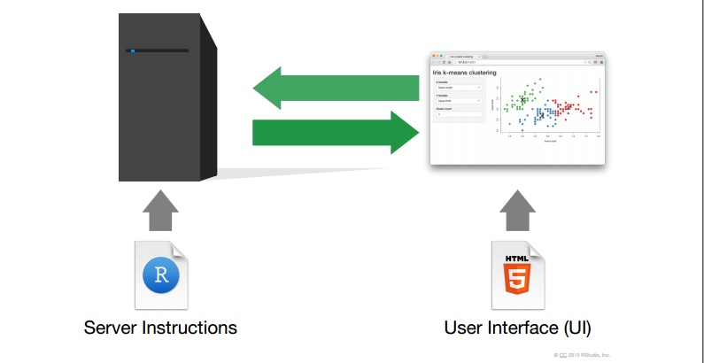
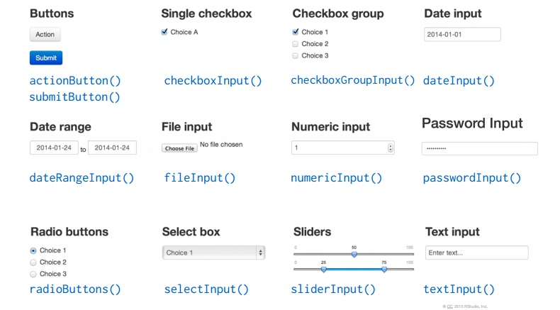
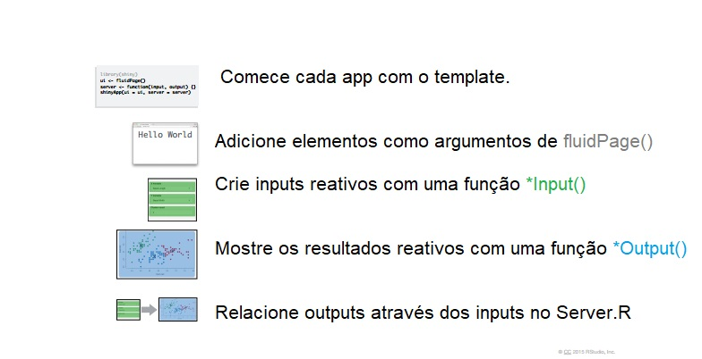
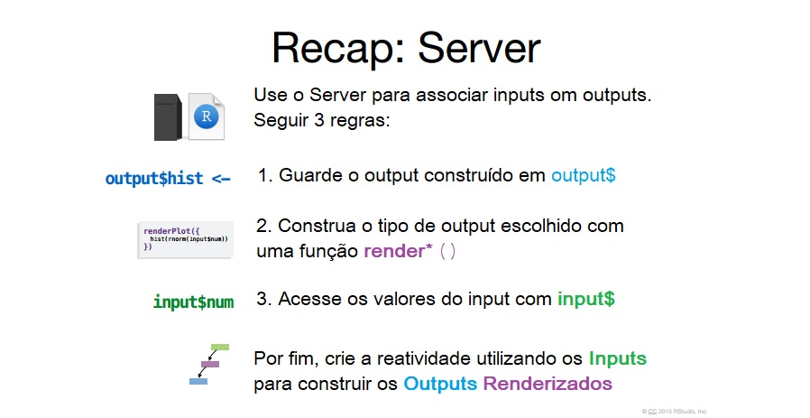

background-image: url(www/slide1.png)
background-size: cover

<link rel="stylesheet" type="text/css" href="www/enap.css">


---

```{r setup, include=FALSE}
options(htmltools.dir.version = FALSE, max.print = 30, digits = 4)
library(tidyverse)

theme_set(
  theme_grey() + theme(legend.position = "top")
)
knitr::opts_chunk$set(
  warning = FALSE, message = FALSE, 
  fig.align = "center", fig.retina = 2, cache = TRUE
)
knitr::opts_hooks$set(fig.callout = function(options) {
  if (options$fig.callout) {
    options$echo <- FALSE
    options$out.width <- "100%"
    options$out.height <- "97%"
  }
  options
})
knitr::opts_hooks$set(fig.principal = function(options) {
  if (options$fig.principal) {
    options$echo <- FALSE
    options$fig.width <- 10
    options$fig.height <- 6
    options$out.width <- "75%"
  }
  options
})
```

# Percurso do curso

<br/>
<br/>

1. Noções de **R**

2. Ciclo da ciência de dados e tidyverse

3. União de dados

4. Lidando com textos

5. Funções

6. **Comunicação: Gráficos**

7. **Comunicação: Markdown e shiny**

---

# Percurso de hoje

1. Etiquetas

1. Anotações

1. Escalas

1. Temas

1. Exportando gráficos

---

# Dados

```{r}
imdb <- read_rds("dados/imdb.rds")

filmes_recentes <- imdb %>% 
  filter(ano >= 2015) %>% 
  mutate(orcamento = orcamento / 1000000,
         receita = receita / 1000000, # em milhões
         lucro = receita - orcamento) 
```

---

# Gráfico base

.pull-left[
```{r prep, eval=FALSE}
colorido <- ggplot(
  filmes_recentes, 
  aes(duracao, receita, col = classificacao)
  ) + geom_point()

colorido
```
]

.pull-right[
```{r, ref.label="prep", fig.callout = TRUE}
```
]

---

# Etiquetas

.pull-left[
```{r label-1, eval=FALSE}
colorido +
  labs(
    title = "Filmes após 2015",
    subtitle = "Subtítulo do gráfico",
    caption = "Fonte: IMDb"
  )
```
]

.pull-right[
```{r, ref.label="label-1", fig.callout = TRUE}
```
]

---

# Etiquetas

.pull-left[
```{r label-2, eval=FALSE}
colorido +
  labs(
    x = "Duração (em minutos)",
    y = "Receita (em milhões de US$)",
    col = "Classificação"
  )
```
]

.pull-right[
```{r, ref.label="label-2", fig.callout = TRUE}
```
]

---

# Anotações

```{r}
label <- tibble(
  duracao = 100,
  receita = 220,
  label = "Teto para maioria dos filmes"
)
```

---

# Anotações

.pull-left[
```{r anotacoes, eval=FALSE}
ggplot(
  filmes_recentes, 
  aes(duracao, receita)
  ) + 
  geom_point() +
  geom_text(aes(label = label), 
            data = label, size = 5)
```
]

.pull-right[
```{r, ref.label="anotacoes", fig.callout = TRUE}
```
]

---

# Escalas

.pull-left[
```{r escalas-1, eval=FALSE}
colorido
```
]

.pull-right[
```{r, ref.label="escalas-1", fig.callout = TRUE}
```
]

---

# Escalas

.pull-left[
```{r escalas-2, eval=FALSE}
colorido +
  scale_x_continuous() +
  scale_y_continuous() +
  scale_colour_discrete()
```
]

.pull-right[
```{r, ref.label="escalas-2", fig.callout = TRUE}
```
]

---

# Escalas

.pull-left[
```{r escalas-3, eval=FALSE}
colorido +
  scale_y_continuous(
    breaks = seq(100, 500, 100)
  )
```
]

.pull-right[
```{r, ref.label="escalas-3", fig.callout = TRUE}
```
]

---

# Escalas

.pull-left[
```{r escalas-4, eval=FALSE}
colorido +
  scale_y_continuous(labels = NULL)
```
]

.pull-right[
```{r, ref.label="escalas-4", fig.callout = TRUE}
```
]

---

# Escalas

.pull-left[

A legenda pode ser posicionada em "top", "bottom",  "left",  "right".

```{r escalas-5, eval=FALSE}
colorido +
  theme(legend.position = "left")
```
]

.pull-right[
```{r, ref.label="escalas-5", fig.callout = TRUE}
```
]

---

# Escalas

.pull-left[

As escalas padrões podem ser substituídas.

```{r escalas-6, eval=FALSE}
colorido +
  scale_colour_brewer(palette = "Set1")
```
]

.pull-right[
```{r, ref.label="escalas-6", fig.callout = TRUE}
```
]

---

# Escalas

.pull-left[

As escalas padrões podem ser substituídas.

```{r escalas-7, eval=FALSE}
colorido +
  scale_colour_manual(values = c(
    "A partir de 13 anos" = "orange",
    "Livre" = "darkblue", 
    "Outros" = "gray", 
    "A partir de 18 anos" = "#ff0000"
))

```
]

.pull-right[
```{r, ref.label="escalas-7", fig.callout = TRUE}
```
]

---

# Temas

.pull-left[
```{r temas-1, eval=FALSE}
colorido +
  theme_bw()
```
]

.pull-right[
```{r, ref.label="temas-1", fig.callout = TRUE}
```
]

---

# Temas

.pull-left[
```{r temas-2, eval=FALSE}
colorido +
  theme_dark()
```

Para conhecer outros temas acesse: 
[este endereço](https://github.com/jrnold/ggthemes)

]

.pull-right[
```{r, ref.label="temas-2", fig.callout = TRUE}
```
]

---

# Exportando gráficos

O `ggplot2` disponibiliza uma função para salvar gráficos.

```{r}
# salva o último gráfico
ggsave("grafico.pdf") # sabe que é pdf 
ggsave("grafico.png") # sabe que é imagem
```

---

# Exportando gráficos

Para salvar de uma imagem podemos usar `pdf()` ou `png()`. 

Nesse casos lembre de "desligar" o "modo salvar".

```{r, eval = FALSE}
pdf("grafico.pdf") # ou png("grafico.png")
meu_grafico1
meu_grafico2
meu_grafico3
dev.off()
```

Atenção! Os gráficos param de aparecer no RStudio quando o 
"modo salvar" estiver ligado.

---

# Relatórios

---

# Rmarkdown

<br>

Markdown é uma linguagem de marcação. 
O Rmarkdown é um arquivo (`*.Rmd`) que permite misturar texto "normal" com código 
de **R**. 

Os documentos de Rmarkdown tem três componentes:

1. Um cabeçalho YAML

2. Texto "normal"

3. Pedaços de código 


---

# Cabeçalho

<br>

No cabeçalho YAML é possível inserir algumas informações sobre o documento 
que será gerado. As mais usadas são:

1. title: título

2. author: nome do autor ou autora

3. date: data (formato YYYY-MM-DD ou )

4. output: formato do documento de saída 
(pdf, pptx, word, slides, etc...)

---

# Cabeçalho: Documentos

<br>

Principais formatos:

* `pdf_document`: Gera documento em PDF usando LaTex

* `word_document`: Gera documento em MS Word

* `html_document`: Gera documento em HTML

* `odt_document`: Gera documento em OpenDocument Text

* `md_document`: Gera documento em markdown

---

# Cabeçalho: apresentações

Principais formatos:

* `ioslides_presentation`: Apresentação HTML (ioslides)

* `slidy_presentation`: Apresentação HTML (slidy)

* `beamer_presentation`: Apresentação em PDF usando LaTex Beamer

* `xaringan::moon_reader`: Apresentação ninja (HTML)

---

# Corpo do texto

<br>

Apesar de o texto "normal", ou prosa, que escrevemos no Rmarkdown 
ser um texto plano, há formas de indicar opções de formatação do texto final.

As principais são:

1. Títulos

2. Formatação do texto

3. Listas

4. Imagens e links

5. Tabelas

---

# Títulos

<br>

```
# Título de 1o nível

## Título de 2o nível

### Título de 3o nível
```

---

# Formatação do texto

<br>

```
\*italico*  ou _italico_
\**negrito** ou  __negrito__
`código`
sobrescrito^2^ e sub-escrito~2~
```

---

# Listas

<br>

```
\*   Item 1 da lista sem numeração

\*   Item 2

    * Item 2a

    * Item 2b

1.  Item 1 da lista numerada

1.  Item 2. Os números aumentam automaticamente no documento final.
```

---

# Imagens e links

<br>

```
<http://enap.gov.br>

[portal da Enap](http://enap.gov.br)


```

---

# Tabelas

<br>

```
Primeira coluna  | Segunda coluna
---------------- | --------------
Conteúdo 1       | Conteúdo 3
Conteúdo 2       | Conteúdo 4
```

---

# Texto como resultado de código

<br>

O texto

```
A tabela `mtcars` tem ` r nrow(mtcars)` linhas.
```

Resulta em:

A tabela `mtcars` tem `r nrow(mtcars)` linhas.

---

# Código

<br>

O código que irá executar calculos e gerar gráficos é geralmente inserido 
dentro de uma _code chunk_. Essa _code chunk_ é definida começando com
```` ```{r} ```` e vai até onde encontrar ```` ``` ````.

No RStudio há um atalho para criar _code chunks_: `ctrl` + `alt` + `I`.


````markdown
`r ''````{r}
nrow(mtcars)
'''
````


---

# Código: opções

<br>

```{r, eval=FALSE}
print("Estou com `eval = FALSE`, então não sairá nenhum resultado")
stop("Isso não vai rodar")
```


---

# Código: opções

<br>

```{r, echo=FALSE}
print("Estou com `echo = FALSE`, então o código não aparece.")
print("Mas o resultado, sim.")
```

---

# Código: opções

<br>

A opção `include = FALSE` faz com que o código rode, porém nada gerado por ele 
(imagem, impressão, mensagem de aviso, etc) seja inclído no documento.

---

# Exercício

---

# Shiny

---

# Sumário

- O que é o shiny?

- Como funciona?

- Interface de usuário

- Input e Outputs

- Server

---

# O que é o Shiny?

- Sistema para desenvolvimento de aplicações web usando o R.

- Um pacote de R (`shiny`).

- Um servidor web (`shiny server`).

---

# O que o Shiny não é?

- O Shiny **não** é uma página web.

- O Shiny **não** é um substituto para sistemas mais gerais, como Ruby on Rails e Django.

- O Shiny **não** é uma ferramenta gerencial, como o Tableau.
---

# Onde aprender mais sobre Shiny

- Tutorial: https://shiny.rstudio.com/tutorial/

- Exemplos: https://shiny.rstudio.com/gallery/

---

# Como funciona?


---

# Template

* **ui** - constrói a interface do usuário.

* **server** - constrói os objetos apresentados ao usuário.

---

# Exercício

<br>

Digite "shinyapp" no script e aperte <a>tab</a>.

---
 
# Inputs e Outputs

<br>

**Inputs** são widgets que possibilitam a interação do usuário com o App.  

**Outputs** são a resposta do app às ações exercidas pelo usuário.

---

# Funções de entrada



---

# Sintaxe

<br> 

Os inputs sempre tem dois argumentos padrão:

1. <a>inputId</a>: forma de nos referirmos ao dado colocado pelo usuário

2. <a>label</a>: Texto para identificação do input

Além deles, há também argumentos específicos de cada input.

---

# Funções de saída

```{r, echo = FALSE}
tibble::tribble(
  ~Função, ~`Tipo de saída`,
  "plotOutput()", "Gráfico",
  "dataTableOutput()", "Tabela interativa",
  "tableOutput()", "Tabela estática",
  "textOutput", "Texto",
  "verbatimTextOutput()", "Saída do R (como se fosse print())",
  "uiOutput()", "Elemento de UI",
  "imageOutput()", "Imagem"
)  %>% knitr::kable("html")
```

---

# Sintaxe

Cada função de saída tem como argumento principal o <a>id</a> do Output.

```{r, eval = FALSE}
# Nome da função
plotOutput("filmes") # id do Ouput
```

Este id será usado para criar a saída no servidor.

---

# Recapitulando




---

# Exercícios

---

# Server.R

<br>
<br>

Para a construção da função `server()`, precisamos seguir 3 regras.

---

# Regras da função server()


---

# Regras da função server()


---

# Funções render*()

```{r, echo = FALSE}
tibble::tribble(
  ~Função, ~`Tipo de saída`,
  "renderPlot()", "Gráfico",
  "renderDataTable()", "Tabela interativa",
  "renderTable()", "Tabela estática",
  "renderText", "Texto",
  "renderPrint()", "Saída do R (como se fosse print())",
  "renderUI()", "Elemento de UI",
  "renderImage()", "Imagem"
) %>% knitr::kable("html")
```

---

# Sintaxe

<br> 

1. Chama função dependendo do tipo de objeto que quer criar.

2. Põe código que criar saída entre chaves <a>{}</a>.

```{r, eval = FALSE}
renderPlot({ # nome da função
  filmes %>%                        # codigo
    filter(ano > input$ano) %>%     # que
    ggplot(aes(duracao, receita)) + # cria
    geom_point()                    # o objeto
})
```


---

# Recapitulando



---

# Exercícios
